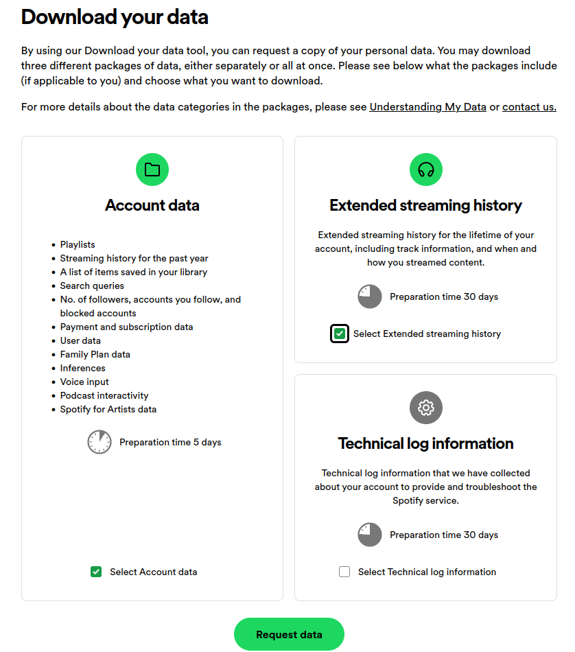

# HOW TO USE

## Step 1. Get your spotify data package

Navigate your favourite browser to https://www.spotify.com/us/account/privacy/

At the bottom you will find this 

Select `extended streaming history` and wait for you data package to arrive with the enthusiasm of a child waiting for their christmas present.

## Step 2. Parse, filter and convert spotify json into scrobbleable json

First move your spotify data.zip into this folder and extract it. You will find your scrobbling data in `/MyData`. Either keep it there or move it somewhere else.

Get lastfm api credentials https://www.last.fm/api/account/create

Fill your key, secret, username, password and date of your first last.fm scrobble into the `example.credentials.env` file and **rename it to `credentials.env`** (eg. remove the `example.` prefix, this is for version management reasons)

Alternatively you could supply these env variables in any other way you want.

Convert your data. For example with data in `/MyData` and splitting into 2600 scrobbles per day (more about that later):
```
$ python convert.py MyData 2600
```

The resulting files will be split into json files in `/results/[n].json`

## Optional step: Analyze

At this point you could do some light analysis of your listening by using `analyze.py` with a given json split.

To analyze all of it, use the `-A` flag with the folder name as the argument.

```
$ python analyze.py results/1.json

$ python analyze.py -A results
```

To see statistics per year, you can use the yearly script:

```
$ python yearly.py results
```

## Step 3. Scrobble tracks to lastfm

Ready to import all your long lost plays of deadmau5 from 2012?

Select a file to scrobble and watch the results. Scrobbling will happen in blocks of 50 tracks and every track will have it's timestamp shifted by a minute from another, starting from 2 weeks ago to keep your weekly stats not fucked up. Lastfm has a hard limit of ~2800 scrobbles per day so keep that in mind. Running this more than once per day with max scrobbles **will** get you rate limited.

```
$ python scrobble.py results/1.json [-v]
```

Optional `-v` parameter will list every track as it scrobbles.
