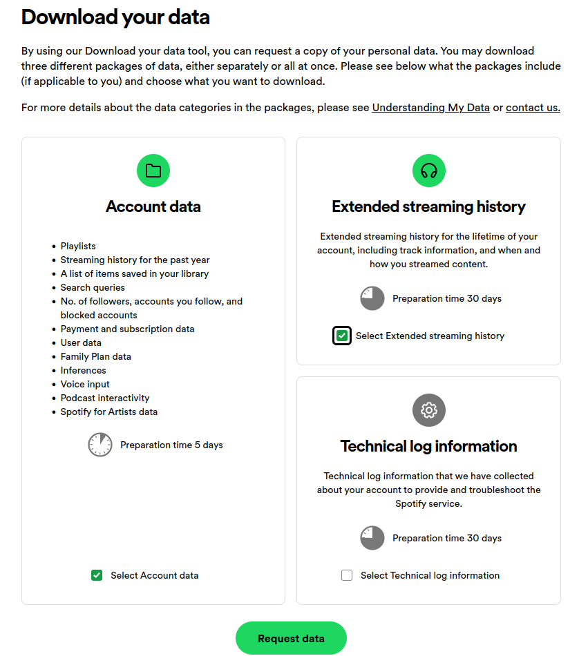

# HOW TO USE

## Step 1. Get your spotify data package

Navigate your favourite browser to https://www.spotify.com/us/account/privacy/

At the bottom you will find this 

Select `extended streaming history` and wait for you data package to arrive with
the enthusiasm of a child waiting for their christmas present.

## Step 2. Parse, filter and convert spotify json into scrobbleable json

> Before getting started you need to install Python and Git however you wish.

### Supported Python versions: 3.13, 3.14

Clone this repo where you want it:

```sh
git clone https://github.com/joinemm/spotify-to-lastfm

cd spotify-to-lastfm
```

Install dependencies:

```sh
python -m pip install -r requirements.txt
```

Move your my_spotify_data.zip into this folder and extract it. You will find
your scrobbling data in `./my_spotify_data/Spotify Extended Streaming History/`.
Either keep it there or move it somewhere else. As long as you know the path.
Note that you will need to either escape the whitespace or quote the whole path
(especially on windows).

Get lastfm api credentials from https://www.last.fm/api/account/create.
Application details can be whatever it doesn't matter.

Fill your key, secret, username, password and date of your first last.fm
scrobble into the `example.credentials.env` file and **rename it to
`credentials.env`** (eg. remove the `example.` prefix, this is for version
management reasons)

Alternatively you could supply these env variables in any other way you want.

> Any further commands assume your working directory is this repo

Open a new terminal/command prompt. On Windows 11 this can be done from the
directory's right click menu (open in terminal).

Convert your data, splitting into 2600 scrobbles per day (more about that
later):

```sh
python convert.py ./"my_spotify_data/Spotify Extended Streaming History" 2600
```

The resulting files will be split into json files in `/results/[n].json`

## Optional step: Analyze

At this point you could do some light analysis of your listening by using
`analyze.py` with a given json split.

To analyze all of it, use the `-A` flag with the folder name as the argument.

```sh
python analyze.py results/1.json

python analyze.py -A results
```

To see statistics per year, you can use the yearly script:

```sh
python yearly.py results
```

## Step 3. Scrobble tracks to lastfm

Ready to import all your long lost plays of deadmau5 from 2012?

Select a file to scrobble and watch the results. Scrobbling will happen in
blocks of 50 tracks and every track will have it's timestamp shifted by a minute
from another, starting from 2 weeks ago to keep your weekly stats not fucked up.
Lastfm has a hard limit of ~2800 scrobbles per day so keep that in mind. Running
this more than once per day with max scrobbles **will** get you rate limited.

```sh
python scrobble.py results/1.json [-v]
```

Optional `-v` parameter will list every track as it scrobbles.
